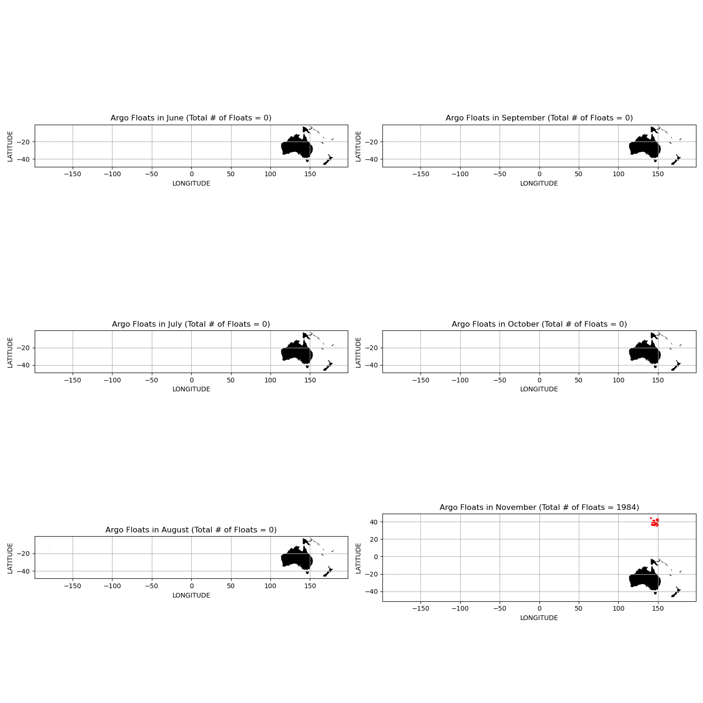

# CMSC6950_Project
Course project for CMSC6950 Spring 2021

Kabir Zubaer

## Software setup

```
    conda create -n argopy
    conda activate argopy
	conda install numpy  
	conda install pandas
	pip install geopandas
	conda install -c conda-forge argopy
	conda install -c conda-forge basemap-data-hires
```

## Start working

```
    conda activate argopy

```


## Computational Tasks

**Task no.1** - Calculating data from Oceania region and over 6 months into an x.array.Dataset



**Task no.2** - Correlation study of  Level, Pressure, Salinity, and Temperature for each month from June 2015 to December 2015 in a region Oceania.

